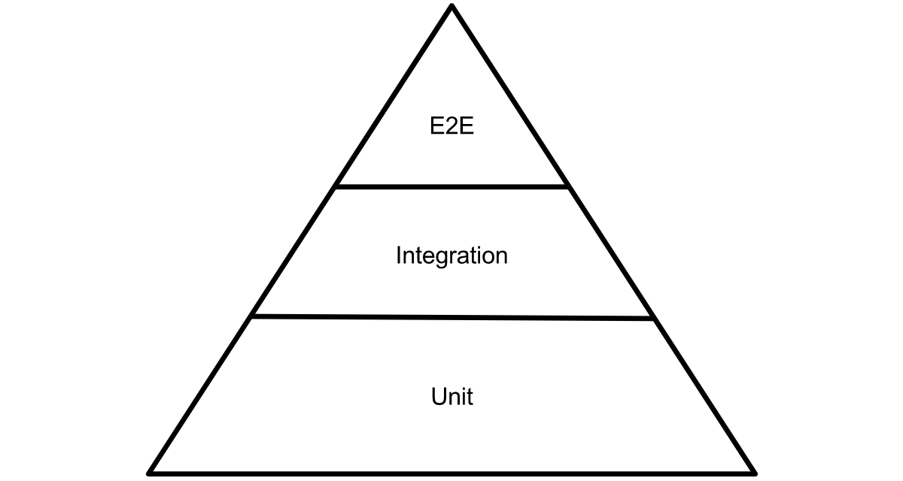

# Spock & Spring

 

## Overview
* Testing Pyramid:
    * There exists three levels of automated testing for our applications:
        * Unit:
        * Integration (IT)
        * End-to-end (E2E)
    * These can be represented as a pyramid, where the width of the level denotes the relative amount of tests
        * In other words, we should have many more unit tests than integration tests (IT's); and many more IT's than E2E test

         

        

         
    
    * As we move up the test pyramid, the resolution of our tests with respect to the implementation should decrease:
        * We want to avoid duplicating test logic by focusing on fine details in our unit tests and only looking at the bigger picture in our IT and E2E tests
    * Definitions:
        * Unit Tests:
            * Where we test the behaviour of a distinct unit of our application, in isolation
            * This is typically at the class-level; we test each method call that is exposed by the class, with collaborating classes being mocked
                * Here, the class is tested as a closed chain
        * Integration Tests:
            * Where we test the interactions between units of our application
            * This is typically at the microservice-level; we test each exposed endpoint that is exposed by the service
                * Here, the microservice is tested as a closed chain
        * End-to-end Tests:
            * Where we test the end-user functionality of our application
            * This is typically at the application-level (usually via the webapp); we test each functionality that is exposed to the user, from the input all the way down through the layers of processing and back to the output
                * Here, the application is tested as a closed chain
* Container Testing:
    * This is a branch of integration testing that focuses purely on exercising the interactions a service (e.g a single Java application) has with the underlying container or framework on which it runs
    * This is to ensure that framework features have been properly understood and configured appropriately
    * Mr Fletcher gives the example of using the `@Transactional` feature with the Spring (as the underlying framework)
        * `@SpringBootTest` is used to start the Spring Container and initialise the application context
* Should you split IT and unit tests into separate suites?
    * Some schools of thought call for this on the grounds that integration tests can be many times slower to run that unit tests
    * Mr Fletcher argues that if there is such a drastic time expensive in running our integration tests, we should consider refactoring them
        * Hence, don't worry about splitting into separate IT and unit suites

 

## Testing Annotation-Driven Transactions

