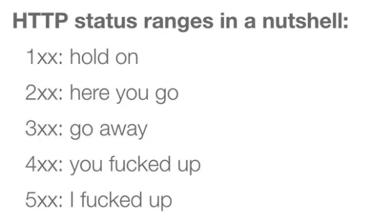

# Testing REST APIs

 

## Overview
* REST, REpresentational State Transfer, is an architectural style for managing data over HTTP
* `@LocalServerPort int port` will inject the port value that is given via `SpringBootTest.WebEnvironment.RANDOM_PORT`
* `TestRestTemplate` is a HTTP client, provided by Spring Boot, for the purpose creating realistic requests to our REST endpoints
    * Example: [`MessageEndpointSpec.groovy`](https://github.com/robfletcher/spock-up-and-running/blob/master/code/squawker-rest-spring/src/test/groovy/squawker/api/MessageEndpointSpec.groovy)

 

## Dealing with Test Data
* Java's H2 in-memory database is a good candidate for holding your test data because it is disposable and won't stick around after the test suite has ran
    * This helps to alleviate the risk of "bleeding data" between tests
    * Similarly, we should clean up test data after each feature method, using the `setup`/`cleanup` lifecycle feature methods
* Java 7 introduced 'try-with-resources', which automatically calls a `.close()` on resources in the `finally` block
    * Groovy provides an equivalent `.withCloseable()` method

 

## Testing Responses
* HTTP Status:
    * Testing for HTTP Errors:
        * When testing REST endpoints, we should invoke edge cases and error scenarios to ensure that our code behaves properly, even after deviation from the happy path
        * For example: when a REST client receives an invalid request, it should respond with a status code in the 400-499 range
    * HTTP Status Ranges:
        * `100-199`: Request has been received but the server is not yet ready to respond
        * `200-299`: Successful request - ex: `200 OK`, `201 CREATED`
        * `300-399`: Indicates that the client needs to go to a different URL to complete the request - ex: `301 PERMANENT REDIRECT`, `302 TEMPORARY REDIRECT`
        * `400-499`: The client has made an error in the request - `400 BAD REQUEST`, `404 NOT FOUND`, `405 METHOD NOT ALLOWED`
        * `500-599`: The request was valid but the server failed to deal with it - ex: `500 SERVER ERROR`, `503 SERVER UNAVAILABLE`
    * In a nutshell:

        

         

* Verifying response data:
    * As a general rule, avoid using standard string matching to verify the structure and content of a response (be it JSON, XML, etc):
        * Instead, parse the result and make specific assertions about individual properties
    * Typed Response Entities:
        * Where possible we should look to use a Typed Response in place of a generic list or map, when working with requests in our test suite
    * `ParameterizedTypeReference` is class that is used in place of another class when defining a response type
        * It retains generic type information at runtime

 

## Backdoor vs "Pure" API Testing
* Scenario: consider the cases where an integration test needs to verify that test data can be requested from a database and uses a second REST request to insert this data for testing; or the reverse, where a test needs to verify that data can be inserted and uses a second REST request to verify the test data was in fact inserted
* Two schools of thought exist on how this should be handled:
    * Pro-Backdoor:
        * Data should not pass through the system-under-test in both directions
            * Here, if you're testing how your system handles the input of data, avoid verifying it by using the mechanism for outputting data
            * Tests that do use both mechanisms are vulnerable to multiple points of failure:
                * Initial input of the data may behave correctly but the retrieval could skew your test result if it fails
        * Additionally, a test that relies purely on using the API's to set up the scenario for the test behaviour can become brittle and long-running
            * If we were testing the checkout of a shopping cart, it would make more sense to to use a 'backdoor' to set up the test behaviour
                * Rather than using the previous API's for login, navigation and adding items to the cart
    * Anti-Backdoor ('Purist'):
        * An end-to-end test should not resort to backdoors:
            * Whilst it makes sense for data in a unit test to only flow in one direction, e2e tests are necessarily different
            * One might consider it 'cheating' the full e2e-nature of a test, if a 'backdoor' is used to read or insert data, or to tweak the state of the system to exhibit test behaviour
            * Additionally, allowing backdoors into your application represents a potential security risk in released software
            * Moreover, there is a design flaw to consider - according to Uncle Bob in Clean Code:
                * "A function should interact with the system at only one level of abstraction"
                * Tests that use backdoors tightly-couple themselves with the underlying details of how elements like persistence and security are handled in the application
* Summary:
    * Both of these schools of thought have their merits; remember that Software Engineering is about trade-offs
    * Using 'backdoors':
        * PROS - more efficient, avoids multiple points of failure
        * CONS - cheats the e2e-nature of system tests, potential design flaw and security risk

 

## Handling Redirects
* Verifying redirect details:
    * Spring's `TestRestTemplate` scans the classpath for various HTTP client libraries and will use whichever is available for the underlying HTTP transport
        * `TestRestTemplate` will automatically disable following redirects, if the underlying library has the capability to do so
        * This is useful to verify the details of a redirect, such as whether the status is `301` or `302`
            * `301 PERMANENT REDIRECT` - the client should not attempt to use the original URL again
            * `302 TEMPORARY REDIRECT` - the endpoint can begin redirecting to a different URL or stop redirecting at all some time in the future

 

## Authentication vs Authorisation
* Authentication:
    * Establishing *who* the requesting user is
    * `401 UNAUTHORIZED` - meaning missing or invalid credentials
    * Note, `UNAUTHORIZED` is referring to the fact that the user could not be 'authenticated'
* Authorisation:
    * Establishing *what* the (already) authenticated user is permitted to do
    * `403 FORBIDDEN` - meaning credentials are valid, insofar as we know who the user is, but they do not have sufficient permissions to perform the action